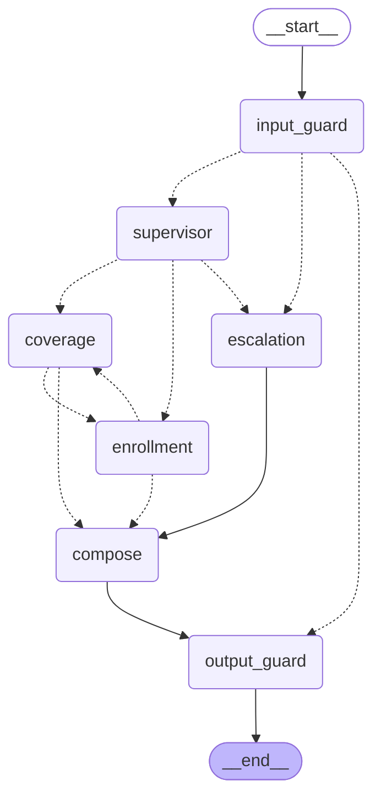

# Agent interaction, and what the frameworks actually do

This repo runs two orchestration engines over one set of tools, guardrails,
prompts and evals:

| | Engine | Entry point |
|---|---|---|
| **native** | Hand-rolled. A guardrail, a regex router, an agent loop. | `orchestrator.py` |
| **graph** | LangGraph `StateGraph`, with LangChain tool bindings. | `graph/run.py` |

Both are scored by the same golden set:

```bash
python -m evals.run --engine native
python -m evals.run --engine graph
```

Keeping both is the point. It forces every claim about the framework to be
specific — if LangGraph is worth a dependency, the difference has to be
nameable, and the eval suite has to show the behaviour did not change while you
got it.

---

## 1. What each framework is actually for

The two get named in the same breath and do unrelated jobs.

**LangChain** is an *integration layer*. Its useful part here is a standard
interface over models and tools: `StructuredTool`, `bind_tools`,
`ChatAnthropic`. It answers "how do I describe a tool once and hand it to any
model." It has no opinion about control flow beyond a linear chain.

**LangGraph** is a *control-flow and durability layer*. `StateGraph`, typed
shared state with reducers, conditional edges, checkpointers, `interrupt()`. It
answers "who runs next, what do they see, and what happens when a human has to
approve something halfway through."

The single sentence worth remembering:

> LangChain gives you a standard way to call a tool. LangGraph gives you a
> standard way to decide who calls it next, and to stop in the middle.

If your system is one agent in a loop, you need neither — `agents/base.py` is
40 lines and it is the whole of it. You start needing LangGraph at the point
where control flow stops being a loop and starts being a graph, and you need a
checkpointer.

---

## 2. Four ways agents interact, and which this uses

Most "multi-agent" systems are one of these four. Knowing which one you built,
and why, is more useful than knowing the API.

| Pattern | Control flow | Good for | Cost |
|---|---|---|---|
| **Chain** | A → B → C, fixed | Known pipelines: extract, then summarise | Cheapest, least flexible |
| **Router** | One classifier picks one specialist | Traffic that splits cleanly by topic | One extra hop |
| **Handoff** | A specialist transfers control mid-run, carrying state | Questions that span two domains | Bounded, but multiplies calls |
| **Supervisor** | A manager calls specialists as tools, loops until satisfied | Open-ended work, unknown number of steps | Most expensive, hardest to bound |

This desk uses **router + handoff**, and deliberately not supervisor.

Why not supervisor: a supervisor loop's step count is decided by a model, so its
cost and latency are unbounded by construction and you are back to trusting a
prompt for a budget. Agent support has a narrow topic space — coverage,
enrollment, escalate — that a regex splits correctly about 70% of the time. The
expensive pattern buys nothing here. **Pick the cheapest pattern that covers the
traffic** is the actual engineering judgement; reaching for a supervisor because
it sounds sophisticated is the most common way these systems become slow and
unaffordable.

---

## 3. The graph

Generated from the compiled graph, not drawn by hand
(`python -m graph.run --diagram`):



Three edges are worth pointing at:

- `input_guard -.-> output_guard` — blocked input skips every model call, so a
  prompt injection costs nothing.
- `coverage <-.-> enrollment` — the handoff, in both directions.
- `escalation` sits behind an `interrupt()`, so that path can stop and wait.

---

## 4. The four mechanisms, in this codebase

### Shared state with reducers — `graph/state.py`

This is what separates multi-agent from sequential chaining, and it is where
the bugs are.

```python
findings: Annotated[list[Finding], operator.add]
```

LangGraph's default for a state key is **last write wins**. Without the reducer,
when the coverage agent hands off to enrollment, enrollment's return value
*replaces* coverage's findings instead of appending. The symptom is not a crash
— it is a fluent, confident answer that silently addresses half the question.

`tests/test_graph.py::test_handoff_preserves_the_first_agent_s_findings` pins
it by asserting both halves survive into the answer.

### Handoff — `graph/nodes.py::coverage`

```python
return Command(goto="enrollment", update=update)
```

`Command` both updates state and names the next node, overriding the static
edge. That is the difference between a graph and a chain: **the data decides the
path**.

*"Does P-1003 cover foreign travel emergency, and when is Medigap open
enrollment?"* is two questions in one coat. A router must pick one destination
and will answer half. Here enrollment answers its half, leaves it on the
blackboard, and hands to coverage — which sees the findings rather than starting
cold.

Every handoff is bounded (`MAX_HANDOFFS = 3`). Two nodes that can each hand to
the other will ping-pong forever on the right input. This is the same argument
as the iteration cap in `agents/base.py`, one level up: **every loop in an agent
system needs a bound, and each bound needs its own reason for existing.**

### Human-in-the-loop — `graph/nodes.py::escalation`

```python
decision = interrupt({"tool": "escalate_to_licensed_agent", ...})
```

`interrupt()` raises, LangGraph persists state exactly as it stands, and the run
ends. A later request — different process, different day — resumes with
`Command(resume=True)` and `interrupt()` *returns* that value instead of
raising.

Two things worth knowing:

1. **A checkpointer is not optional.** `interrupt()` does nothing without one.
   `MemorySaver` is right for tests and wrong for production; swap
   `PostgresSaver` and the pause survives a restart and a load balancer.
2. **The node replays from its first line on resume.** Anything above the
   `interrupt()` call happens twice. Side effects belong below it, or in their
   own node. This is the most common way people get burned.

`graph/run.py::resume()` is a separate entry point on purpose — it takes only a
`thread_id`, because in production the approval is a separate HTTP request and
everything else comes back from the checkpointer.

### Fan-in — `graph/nodes.py::compose`

Deterministic string assembly, **not** a model call. Asking a model to "combine
these findings" is a fresh chance to hallucinate a claim no tool produced, and
it would sit downstream of every guardrail that made those findings
trustworthy. When the parts are already sourced, joining them is not a job for
an LLM.

The non-obvious part is deduplication. Two specialists handed the same question
both call `lookup_policy`, so both answers open with the same policy record.
Comparing whole answers does not catch it, because they diverge after the first
sentence — so dedup runs at sentence level, with two exceptions that cost real
correctness:

- a trailing `[benefits-kb/…]` citation is **not** split from its claim, or
  dedup can drop a citation and leave a factual statement unsourced;
- `A.` in `A. Rivera` is an initial, not a sentence end.

---

## 5. Why the tools are wrapped, not handed over

`graph/lc_tools.py` is short and it is the most important file in the directory.

```python
StructuredTool.from_function(lookup_policy)   # WRONG — guardrail is gone
```

Do that and LangChain calls the raw function the moment the model emits a tool
call. Nothing checks the allow-list, validates arguments, enforces the rate
limit or requires approval. **The security boundary is wherever execution
actually happens**, so that is where the check has to live — `guarded()` closes
over the policy and returns a tool that cannot be called around it.

The JSON Schemas are also *not* redeclared. `tools/registry.py` already holds
them, because a tool schema is a contract with the model and two copies is how
they drift. The same `input_schema` dict goes to the Anthropic SDK in
`agents/base.py` and to LangChain here. One definition, two frameworks.

---

## 6. Why not `create_react_agent`

The prebuilt agent would replace `agents/base.py` entirely, and it is genuinely
the right way to start. It is not used here for a specific reason rather than
a stylistic one.

`agents/base.py` enforces things this desk needs and the prebuilt does not give
in the shape required:

| | This loop | `create_react_agent` |
|---|---|---|
| Iteration cap | yes | via recursion limit |
| **Token budget** | yes, checked before spending | not built in |
| **Wall-clock cap** | yes | not built in |
| Retry policy | 429/5xx backoff, **never** on 4xx | provider defaults |
| Truncation | `stop_reason == "max_tokens"` handled explicitly | not surfaced |

Adopting a prebuilt agent means adopting its budget semantics instead of yours.
The honest rule: **use it to start, replace it the moment your failure modes
stop matching its defaults.** Here they already had — the loop existed, was
traced, and was covered by the eval suite before the graph was added.

So the division of labour is:

```
LangGraph  owns INTER-agent control flow
           who runs, in what order, who hands to whom, where a human interrupts

agents/    owns INTRA-agent tool calling
base.py    the while-loop, the budgets, the retry policy, truncation
```

---

## 7. Proving the port did not change behaviour

This is the part most framework migrations skip.

`evals/run.py` takes `--engine`, both engines expose the same result shape, and
every scorer runs unchanged against either. CI gates both against their own
committed baseline. On top of that, `tests/test_graph.py` runs the whole golden
set through **both** engines and asserts they agree on the two things a port has
no business changing:

```python
assert graph.blocked_by == native.blocked_by
assert set(graph.trace.guardrails_triggered()) == set(native.trace.guardrails_triggered())
```

It deliberately does **not** compare answer strings — the graph composes from
findings, so wording differs legitimately. Routing and guardrails are the
invariants; prose is not.

"It looked fine when I tried it" is not a migration test.

---

## 8. What the framework did not do

Worth being blunt, because it is the question behind the question.

LangGraph moved the orchestration. It did not do the engineering. The parts of
this system that make it defensible to a compliance stakeholder are all
framework-independent, and all of them predate the graph:

- guardrails are deterministic code, not prompt text (`guardrails/rules.py`)
- PII is stripped at the tool boundary, before it can enter a context window
  (`tools/registry.py`)
- the eval suite scores **trajectory**, not just answers (`evals/run.py`)
- the regression gate protects safety categories separately from the aggregate
- prompts are versioned and CI-checked (`tools/prompt_hygiene.py`)

A framework is a way to spend your complexity budget on control flow instead of
on plumbing. It is not a substitute for deciding what the system must never do.
